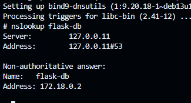
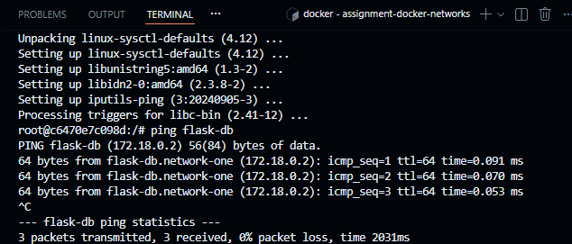
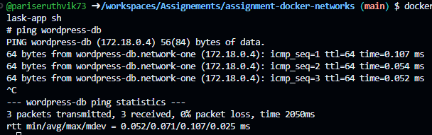

# Docker Networks Assignment - Network Isolation

## 1. Assignment Overview

This assignment demonstrates Docker network isolation by creating two separate application stacks on the same machine, each with their own network. The goal is to understand how Docker networks provide isolation between applications and enable service discovery through DNS.

**Stack 1: Flask + PostgreSQL**
- Application: Flask (Python web application)
- Database: PostgreSQL
- Network: network-one

**Stack 2: WordPress + MySQL**
- Application: WordPress (PHP CMS)
- Database: MySQL
- Network: network-two (for isolation testing)

---

## 2. Part A - Same Network Setup

### Step 1: Create Network One

```bash
docker network create network-one
```

### Step 2: Run Flask and PostgreSQL on Network One

```bash
# Run PostgreSQL container
docker run -d \
  --name flask-db \
  --network network-one \
  -e POSTGRES_PASSWORD=password \
  -e POSTGRES_USER=postgres \
  -e POSTGRES_DB=flaskdb \
  postgres:14

# Run Flask container
docker run -d \
  --name flask-app \
  --network network-one \
  -p 5000:5000 \
  <your-flask-image>
```

### Step 3: Verify Flask can Connect to PostgreSQL

```bash
# Login to Flask container
docker exec -it flask-app sh

# Try to ping the database by name
ping flask-db

# Try DNS resolution
nslookup flask-db

# Exit
exit
```

**Screenshot 1: DNS Resolution from Flask App to Flask DB**



**Observation**: The `nslookup` command successfully resolved `flask-db` to IP address `172.18.0.2`, demonstrating that Docker's internal DNS service is working correctly on `network-one`. This allows containers to communicate using container names instead of hardcoded IP addresses.

### Step 4: Run WordPress and MySQL on Network One

```bash
# Run MySQL container
docker run -d \
  --name wordpress-db \
  --network network-one \
  -e MYSQL_ROOT_PASSWORD=password \
  -e MYSQL_DATABASE=wordpress \
  mysql:8.0

# Run WordPress container
docker run -d \
  --name wordpress-app \
  --network network-one \
  -p 8080:80 \
  -e WORDPRESS_DB_HOST=wordpress-db \
  -e WORDPRESS_DB_USER=root \
  -e WORDPRESS_DB_PASSWORD=password \
  -e WORDPRESS_DB_NAME=wordpress \
  wordpress:latest
```

### Step 5: Test Cross-Stack Communication (Same Network)

```bash
# Login to Flask/Task container
docker exec -it task-app sh

# Try to ping WordPress database (should WORK - same network)
ping wordpress-db

# Exit
exit
```

**Screenshot 2: Successful Ping from Flask to WordPress on Same Network**



**Observation**: The ping from the Flask app container to `wordpress-db` was successful, receiving 3 packets with 0% packet loss. This confirms that containers on the same Docker network (`network-one`) can communicate with each other using DNS-based service discovery.

---

## 3. Part B - Different Networks Setup (Isolation)

### Step 1: Clean Up Previous Setup

```bash
docker rm -f flask-app flask-db wordpress-app wordpress-db
docker network rm network-one
```

### Step 2: Create Two Separate Networks

```bash
docker network create network-one
docker network create network-two
```

### Step 3: Run Flask Stack on Network One

```bash
# PostgreSQL
docker run -d \
  --name flask-db \
  --network network-one \
  -e POSTGRES_PASSWORD=password \
  -e POSTGRES_USER=postgres \
  -e POSTGRES_DB=flaskdb \
  postgres:14

# Flask App
docker run -d \
  --name flask-app \
  --network network-one \
  -p 5000:5000 \
  <your-flask-image>
```

### Step 4: Run WordPress Stack on Network Two

```bash
# MySQL
docker run -d \
  --name wordpress-db \
  --network network-two \
  -e MYSQL_ROOT_PASSWORD=password \
  -e MYSQL_DATABASE=wordpress \
  mysql:8.0

# WordPress
docker run -d \
  --name wordpress-app \
  --network network-two \
  -p 8080:80 \
  -e WORDPRESS_DB_HOST=wordpress-db \
  -e WORDPRESS_DB_USER=root \
  -e WORDPRESS_DB_PASSWORD=password \
  -e WORDPRESS_DB_NAME=wordpress \
  wordpress:latest
```

### Step 5: Test Isolation Between Networks

```bash
# Login to Flask container
docker exec -it flask-app sh

# Try to ping Flask database (should WORK - same network)
ping flask-db

# Try to ping WordPress database (should FAIL - different network)
ping wordpress-db

# Exit
exit
```

---

## 4. Observations & Results

### Screenshot 3: Ping to WordPress DB on Same Network



**Observation**: When both Flask and WordPress containers were on the same network (`network-one`), the ping from `task-app` to `wordpress-db` was successful. The container resolved to IP `172.18.0.4` and received responses, proving that same-network communication works as expected.

### Screenshot 4: Network Isolation - Ping Failure to Different Network


**Observation**: After moving WordPress to `network-two`, the results clearly show network isolation in action:

- ✅ **Ping to `flask-db` (172.18.0.2)**: SUCCESS - 4 packets transmitted, 4 received, 0% packet loss
- ❌ **Ping to `wordpress-db`**: FAILED - "Name or service not known"

This demonstrates that Docker networks provide complete isolation. Containers on `network-one` cannot even resolve DNS names of containers on `network-two`, let alone communicate with them.

---

## 5. Key Learnings

### Why Custom Networks are Important

Custom Docker networks provide several critical advantages over the default bridge network. They enable automatic DNS resolution, allowing containers to communicate using container names instead of IP addresses, making configuration more maintainable and dynamic. Network isolation ensures that each custom network creates an isolated environment where only containers explicitly connected to that network can communicate. This enhances security by preventing unauthorized access between different application stacks, even when running on the same host. Built-in DNS makes it easy for containers to discover and communicate with each other without hardcoding IP addresses.

### How Network Isolation Works

Docker implements network isolation through Linux network namespaces and virtual bridges. Each custom network creates a separate virtual bridge with its own subnet (e.g., 172.18.0.0/16, 172.19.0.0/16). Containers on different networks have no routing path to each other by default. The Docker DNS server (embedded DNS at 127.0.0.11) only resolves names for containers within the same network. This isolation is enforced at the kernel level, making it robust and secure.

### Real-World Use Case

Consider a multi-tenant development environment where multiple teams are testing their applications on a shared server. Team A is developing a Flask API with PostgreSQL on `team-a-network`, Team B is developing a WordPress site with MySQL on `team-b-network`, and Team C is developing a Node.js app with MongoDB on `team-c-network`. Network isolation ensures that each team's database is completely isolated from other teams, accidental database connections are impossible (DNS won't even resolve), port conflicts are avoided (each stack can use standard ports internally), and security is maintained without complex firewall rules. This same principle applies to production microservices architectures, where different services need to communicate within their domain but remain isolated from unrelated services.

---

## 6. Conclusion

This assignment successfully demonstrated Docker network isolation by:

1. Creating two separate application stacks (Flask + PostgreSQL, WordPress + MySQL)
2. Verifying DNS-based service discovery within the same network
3. Confirming successful communication between containers on the same network
4. Proving complete isolation between containers on different networks
5. Understanding the security and organizational benefits of custom Docker networks

**Key Takeaway**: Docker custom networks are essential for building secure, maintainable, and scalable containerized applications. They provide the foundation for microservices architectures and multi-tenant environments.

---

## 7. Useful Commands

```bash
# Create networks
docker network create network-one
docker network create network-two

# List networks
docker network ls

# Inspect a network
docker network inspect network-one

# Remove a network
docker network rm network-one

# Check running containers
docker ps

# Execute commands in container
docker exec -it <container-name> sh

# View container logs
docker logs <container-name>

# Clean up all containers
docker rm -f $(docker ps -aq)

# Remove unused networks
docker network prune
```
